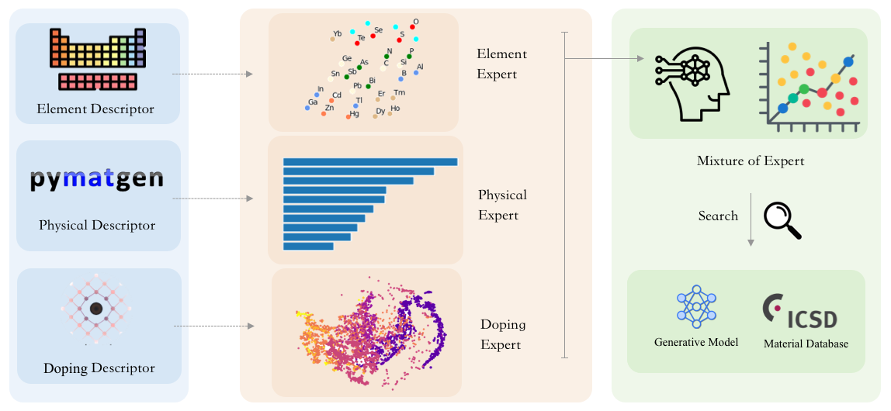

# Doping-Adaptive Mixture-of-Experts Model for Precise Prediction of Superconducting Critical Temperatures



This project presents a novel Mixture-of-Experts (MoE) model for accurately predicting superconducting critical temperatures. The model leverages the strengths of three specialized experts, each focusing on distinct aspects of superconductivity.

## Model Architecture and Training

The MoE model consists of three expert networks and a gating network:

* **Doping Expert:** Specializes in capturing the influence of doping levels on critical temperature.
* **Element Expert:** Focuses on the inherent superconducting properties of constituent elements.
* **Physics Expert:**  Analyzes relevant physical parameters to predict critical temperature.

The gating network learns to assign weights to the predictions of each expert based on the input data, effectively combining their expertise for a more accurate overall prediction.

## Running the Model

### 1. Training the Expert Networks

Train each expert model separately. This will generate 30 weight files (10 for each expert) in the `model` folder.

```bash
python doping_expert.py
python element_expert.py
python physics_expert.py
```
### 2. Training the MoE Model

Train the MoE model. It will automatically load the pre-trained expert weights and train the gating network.

```bash
python MoE.py
```

## Key Features

* **Doping Adaptivity:** The model explicitly accounts for the crucial role of doping in superconductivity.
* **Expert Specialization:**  Leveraging multiple experts allows the model to capture diverse factors influencing critical temperature.
* **Improved Accuracy:** The MoE architecture outperforms traditional models in predicting superconducting critical temperatures.

## Future Work

* Explore the inclusion of additional experts focusing on other relevant factors.
* Investigate the application of the model to predict other superconducting properties. 